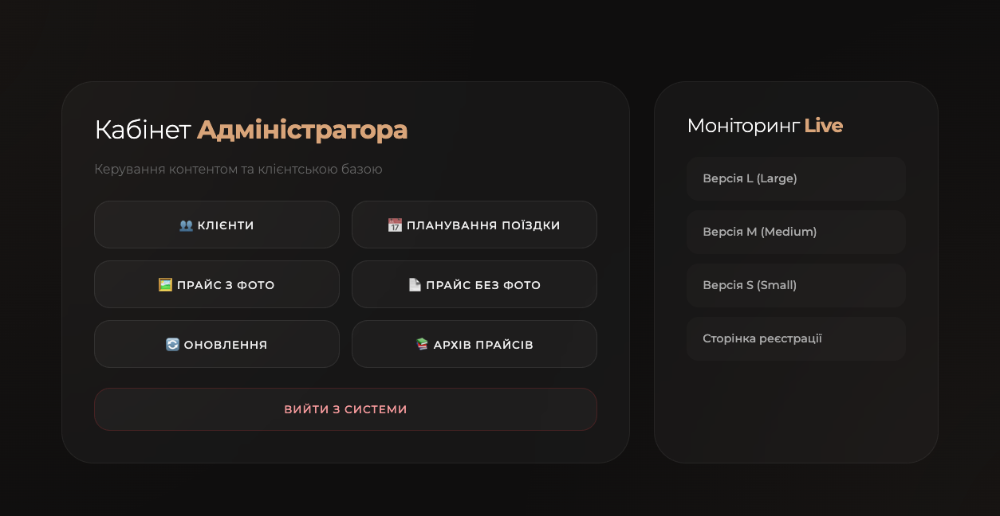

# price-service

**price-service** — це вебсервіс для керування та перегляду прайсів на товари. Система розроблена для компанії, що займається продажем кавової продукції, і дозволяє адміністраторам завантажувати прайси з товарами, а клієнтам — переглядати ціни відповідно до своєї групи.

## 📌 Основні функціональні можливості

### Адміністративна частина (особистий кабінет адміністратора):

- Завантаження прайсу з фото
- Завантаження прайсу без фото
- Завантаження лише оновлень асортименту
- Перегляд раніше завантажених прайсів
- Планування поїздок (внутрішній функціонал)
- Вихід із системи

### Користувацька частина:

- Перегляд прайсу відповідно до групи (S, M, L)
- Актуальні дані по товарах та цінах
- Доступ до прайсу з фото / без фото / оновлень

## 🛠️ Технології

- Java 17
- Spring Boot (Web, Security)
- Hibernate (JPA)
- MySQL
- Maven

## 🚀 Розгортання

Сервіс уже розгорнутий і працює у мережі. Доступ клієнтів здійснюється через унікальні URL-посилання, відповідно до групи, до якої вони належать.

> 🔒 Доступ до адміністративної панелі захищений авторизацією через Spring Security.

## 📷 Інтерфейс

| Особистий кабінет адміністратора | Інтерфейс для клієнтів |
|----------------------------------|------------------------|
|          |  |

## ⚠️ Примітка

Це комерційний проєкт. Документація не містить зайвої технічної або бізнес-інформації.

---

